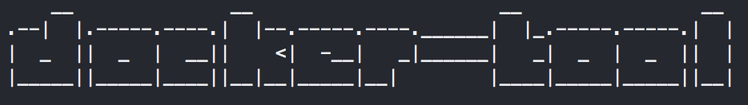
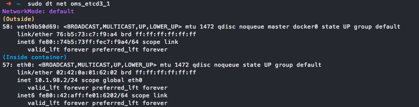
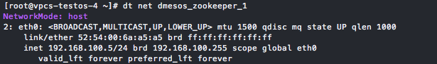
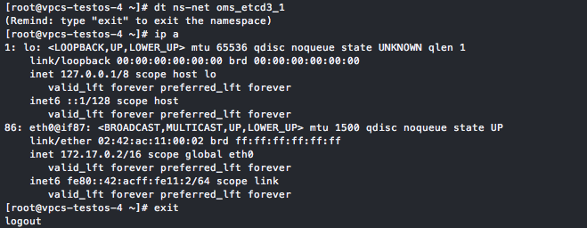
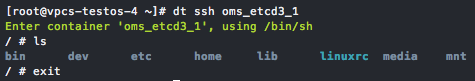
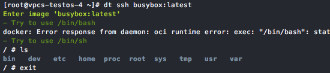
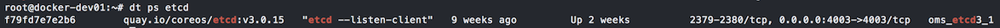
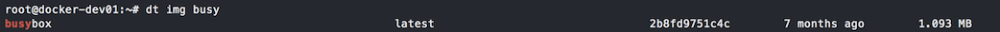

# dt (docker-tool)



It is a convenient tool for many Docker operations.

It is **NOT** just an "alias" to the Docker cli, it can do many really helpful things for you.

## Installation

```bash
INSTALL_DIR='/usr/local/bin'
wget -O ${INSTALL_DIR}/docker-tool https://raw.githubusercontent.com/ohmystack/docker-tool/master/docker-tool
chmod a+x ${INSTALL_DIR}/docker-tool
ln -sf ${INSTALL_DIR}/docker-tool ${INSTALL_DIR}/dt
```

You can use command-line `docker-tool` or `dt` for short.

> Upgrade:
> 
> ```bash
> dt self-upgrade
> ```


## Key Features

* `dt pid`

Get the pid of a container.


* `dt net`

Get the network type and info.  
You can even get the **veth pair info** of a container if it is using the "default" NetworkMode. This is very helpful when debugging the network.




* `dt ns-net`

Enter the network namespace of a container.  
So that you can use the utils installed on your server to debug the container inside network.



* `dt ssh`

Go inside both container or image, automatically choose to use `bash` or `sh`.
> Before this, you always type `docker exec -it xxx /bin/bash`, and then find that there is no `bash` in the container, then change to `sh`. Or, type `docker run -it --rm --entrypoint /bin/bash xxx` to get into an image.
> Now, you only need the `dt ssh`.





* `dt ps` & `dt img`

Search (or list) the containers and images.





* `dt logs`

Short for `docker logs --tail=50 -f <container-id/name>`.

> ...
> 
> More features, you can check `dt help`.


## Development

If you have any good ideas about `docker-tool`, welcome to submit your PRs.

One simple rule: Keep this `docker-tool` a single file bash program.

[@ohmystack](https://github.com/ohmystack)
